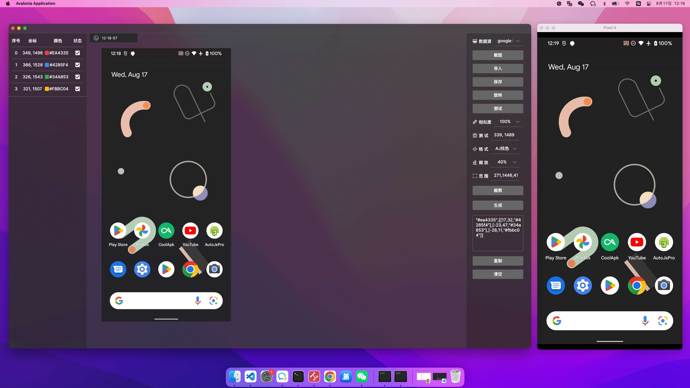

   

<h3 align="center">ScriptGraphicHelper For Mac</h3>

**一款简单好用的图色助手,  快速生成多种脚本开发工具的图色格式代码**

**在yiszza/ScriptGraphicHelper 1.4 基础上进行优化改造，更好的适配mac端**

> 只支持autojs方式链接

 

## 功能

- AJ连接模式: 调用aj的tcp调试端口进行截图(需要安装autojs.pro 8, 并开启调试服务和悬浮窗)
- 一键生成autojs找色代码
- 一键生成autojs找色函数
- 识别区域显示

## 构建

https://docs.avaloniaui.net/docs/distribution-publishing/macos

 

