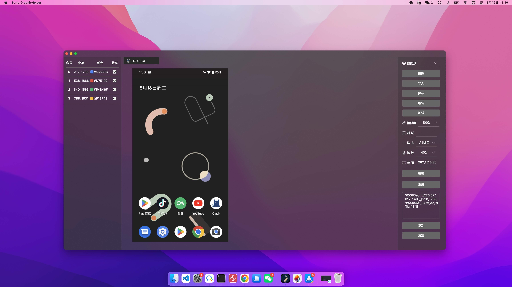

# ScriptGraphicHelper For Mac

**一款简单好用的图色助手,  快速生成多种脚本开发工具的图色格式代码**

**在yiszza/ScriptGraphicHelper 1.4 基础上进行优化改造，更好的适配mac端**

**只支持autojs方式链接**

 

## 功能

- AJ连接模式: 调用aj的tcp调试端口进行截图(需要安装autojs.pro 8, 并开启调试服务和悬浮窗)
- 一键生成autojs比色代码

 

